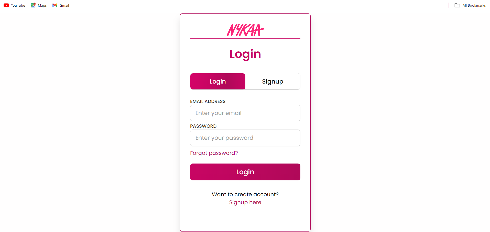
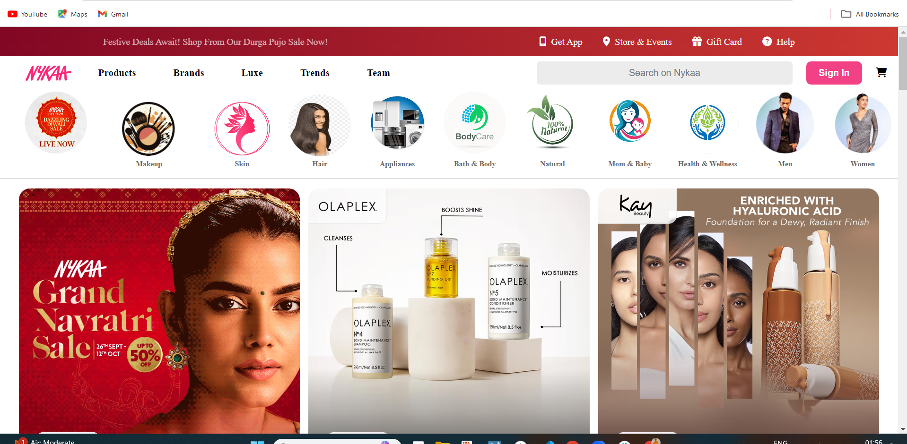
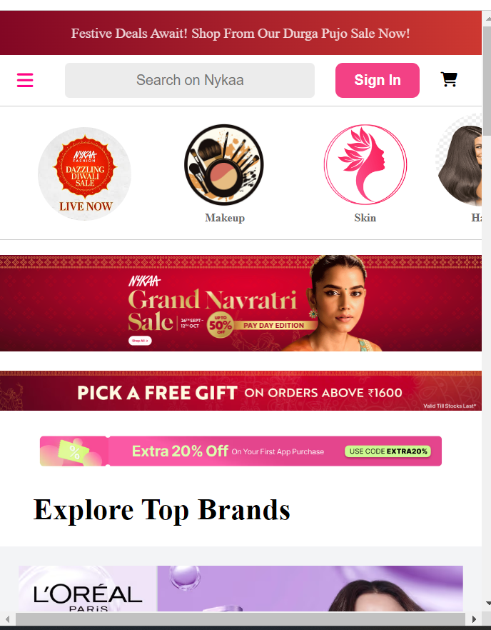
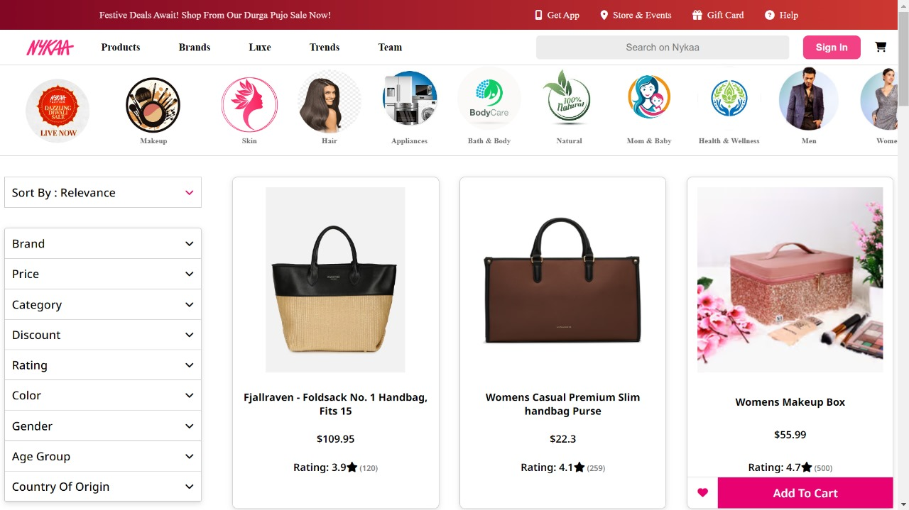

# EV-Engineers_019

## Introduction
The Naykaa E-commerce website is a highly responsive and visually engaging platform, designed to emulate a real-world online shopping experience for beauty and wellness products. Built using HTML, CSS, and JavaScript, this project focuses on delivering a smooth, intuitive user experience that addresses common challenges in e-commerce, such as product discoverability, seamless navigation, and interactive design. By integrating dynamic elements and responsive layouts, this website enhances the user’s ability to explore, select, and purchase products efficiently, ensuring an enjoyable shopping experience on any device.

## Project Type
Frontend 

## Deplolyed App
Frontend: https://glistening-gingersnap-7dec72.netlify.app/

## Directory Structure
EV-ENGINEERS/
├─ Assests
| ├─ Products
| ...
## Video Walkthrough of the project
[Attach your video walkthrough link here] Duration: 1 - 3 minutes

A visual tour through the key features and the overall shopping flow of the website.

## Video Walkthrough of the codebase
[Attach your codebase walkthrough link here] Duration: 1 - 5 minutes

An overview of the project's architecture, focusing on how HTML, CSS, and JavaScript are structured to bring dynamic elements and responsiveness to the site.

## Features
1) Product Listing and Filtering: 
Users can browse a wide range of beauty and wellness products, filter by category, price range, and brand, making it easier to find desired items.

2) Search Functionality: 
An efficient search bar allows users to quickly find specific products by name or keyword.

3) Product Details Page: 
Each product has a dedicated page showing detailed descriptions, images, reviews, and pricing, providing users with all necessary information.

4) Shopping Cart and Checkout: 
Users can add products to their cart and proceed to checkout, where they can review items, adjust quantities, and complete purchases.

5) User Authentication: 
Basic user login and registration functionality ensures a personalized shopping experience with saved preferences and order history.

6) Responsive Design: 
The site is fully responsive, adapting to various screen sizes and devices for a smooth user experience on mobile, tablet, and desktop. The design adapts fluidly to different screen sizes for a professional look and feel.

7) Interactive UI: 
Intuitive and interactive elements like hover effects, dropdowns, smooth scrolling, dynamic content loading  and dropdown menus enhance the overall shopping experience.


## design decisions or assumptions

# Responsive Design First
Design Decision: Adopted a mobile-first approach to ensure the website is fully responsive and functions smoothly on all device sizes (mobile, tablet, and desktop).

Assumption: Majority of users will access the site via mobile devices, so the design prioritizes mobile usability without compromising the desktop experience.

# Minimal JavaScript for Core Functionality
Design Decision: Utilized JavaScript only where necessary to enhance the interactivity of the site, such as enabling search, filtering, and dropdown menus, while keeping the overall codebase lightweight.

Assumption: Users prefer fast load times and simple interactivity over complex animations or heavy use of JavaScript, particularly for e-commerce websites.

# Static Frontend Without Backend Integration
Design Decision: Developed the website as a static frontend project with no backend integration. All product data and functionality (e.g., product listing, cart operations) are hardcoded.

Assumption: The website is intended as a front-end prototype for showcasing design and UI/UX, assuming that dynamic features and database integration could be added later if needed.
# Intuitive Navigation and User Flow
Design Decision: Created a minimalistic and easy-to-navigate layout, allowing users to find products and essential features (e.g., cart, search) without confusion.

Assumption: Users expect a straightforward interface where navigation is intuitive and requires minimal clicks to reach their desired actions.

# Consistent Branding and Visual Identity
Design Decision: Followed a consistent visual theme with a clean, modern design using complementary colors, typography, and imagery suited to the beauty and wellness industry.

Assumption: A polished and aesthetically appealing website will increase user engagement and build trust, aligning with users’ expectations of high-quality e-commerce brands.

# Static Product Data for Demonstration
Design Decision: Chose to hardcode product information and interactions for simplicity in this version of the project.

Assumption: This design is suitable for demonstration purposes, assuming users will focus on the layout and interface rather than expecting real-time dynamic product data.


## Usage

To use the Naykaa E-commerce website, follow these steps:

1) Visit the Website
Navigate to the deployed app using the link provided: https://glistening-gingersnap-7dec72.netlify.app/
This will take you to the homepage where you can browse available products and use various features of the website.

2) Browse Products
Use the navigation bar to browse different categories of beauty and wellness products. You can use the filters or the search bar to find specific items.

3) View Product Details
Click on any product to view detailed information, including price, description, images, and customer reviews.

4) Add Products to Cart
After reviewing a product, click the "Add to Cart" button to add the item to your shopping cart. You can view and modify your cart by clicking the cart icon at the top right of the page.

5) Proceed to Checkout
Once you are satisfied with your selections, proceed to checkout by clicking the "Proceed to Buy" button in your cart. Follow the steps to complete your order.

```bash
# Step-by-Step Example of Adding a Product to Cart and Checking Out
1. Open the homepage.
2. Search for "Jeans" in the search bar.
3. Choose a product from the search results and click "Add to Cart."
4. Go to the cart and click "Proceed to Buy."
5. Complete the purchase by filling in the required information.

```
<<<Screenshots>>>
1. Homepage: This is the homepage where users can browse through featured products and navigate the website.






2. Product Details Page: Here, users can view detailed information about each product, including images, descriptions, and customer reviews.




3. Shopping Cart: This is the shopping cart view where users can see their selected products and proceed to checkout.


<!-- 
## Credentials
user id - 
password -

## APIs Used
If your application relies on external APIs, document them and include any necessary links or references.

## API Endpoints
In case of Backend Applications provide a list of your API endpoints, methods, brief descriptions, and examples of request/response.
GET /api/items - retrieve all items
POST /api/items - create a new item
-->

## Technology Stack
List and provide a brief overview of the technologies used in the project.
- HTML
- CSS
- Java Script

# Links

- Deployed Link: https://glistening-gingersnap-7dec72.netlify.app/
- GitHub Link: https://github.com/princekesDEV/EV-Engineers_019/tree/main